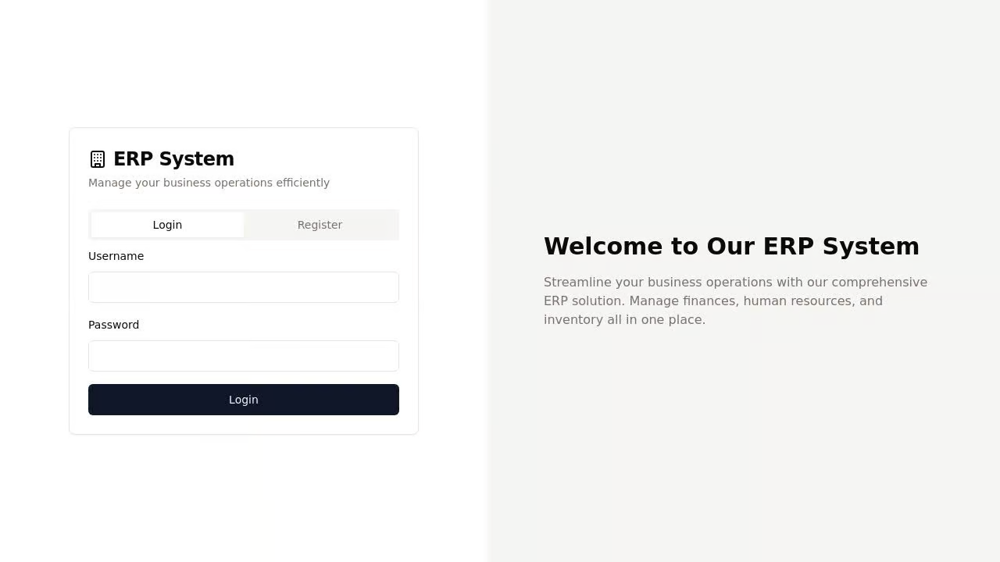

# ERP System

A web-based Enterprise Resource Planning (ERP) system built with React and Express.js, focusing on Financial Management, Human Resources, and Inventory Management.



## Features

### Financial Management
- Transaction tracking with multi-currency support (USD, EUR, IDR)
- Income and expense categorization
- Real-time currency conversion
- Financial dashboard with key metrics

### Human Resources (HR)
- Employee information management
- Department and position tracking
- Salary management
- Active/inactive status tracking

### Inventory Management
- Stock level monitoring
- Low stock alerts
- Unit and category management
- Quick quantity adjustments

## Tech Stack

### Frontend
- React with TypeScript
- TanStack Query for data fetching
- React Hook Form for form management
- Wouter for routing
- Shadcn UI components
- Tailwind CSS for styling

### Backend
- Express.js
- Passport.js for authentication
- In-memory storage (can be extended to use PostgreSQL)
- Zod for schema validation

## Getting Started

### Prerequisites
- Node.js 20 or higher
- npm

### Installation

1. Clone the repository
2. Install dependencies:
```bash
npm install
```

3. Start the development server:
```bash
npm run dev
```

The application will be available at `http://localhost:5000`

## Usage

### Authentication
- Register a new account or login with existing credentials
- All features require authentication

### Financial Management
- Add new transactions with details (amount, type, category)
- View financial summary in different currencies
- Track income and expenses
- View transaction history

### HR Management
- Add new employees with their details
- Manage employee status
- View department-wise employee distribution
- Track salary information

### Inventory Management
- Add new inventory items
- Set minimum quantity thresholds for alerts
- Track stock levels
- Adjust quantities with quick actions

## Project Structure

```
├── client/              # Frontend React application
│   ├── src/
│   │   ├── components/  # Reusable UI components
│   │   ├── hooks/      # Custom React hooks
│   │   ├── lib/        # Utilities and helpers
│   │   ├── pages/      # Page components
│   │   └── App.tsx     # Main application component
├── server/             # Backend Express application
│   ├── auth.ts         # Authentication setup
│   ├── routes.ts       # API routes
│   └── storage.ts      # Data storage implementation
└── shared/             # Shared types and schemas
    └── schema.ts       # Database schema and types
```

## Future Enhancements

1. Sales and Distribution Module
   - Order management
   - Distribution tracking
   - Customer management

2. Production Module
   - Production planning
   - Quality control
   - Raw material management

3. Advanced Reporting
   - Data visualization
   - Custom report generation
   - Export capabilities

4. Procurement Module
   - Supplier management
   - Purchase order tracking
   - Invoice management

## Contributing

Contributions are welcome! Please feel free to submit a Pull Request.

## License

This project is licensed under the MIT License - see the LICENSE file for details.
